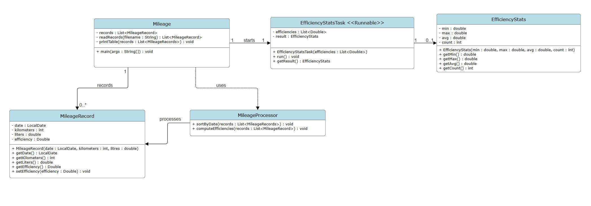

# Java_CA2_Fuel_Efficiency
Github repository for collaborative work during the Java &amp; Algorithms CA2
This project was worked on with Niki Spasov, shoutout to him. 
Original repo was found here:  [Repo](https://github.com/NikiSp737/Java_CA2_Fuel_Efficiency)
---

## Introduction:

For this project a user came up with a problem describing it like this:

"I keep a file with details of my car's mileage. Whenever I fill up with petrol I enter the odometer reading (the total km the car has travelled) and the amount of petrol (in litres) 
I've just bought, beside each other on a single line. 
A sample of the text file’s contents might look as follows. 
NB I always fill my tank right to the top. 
However, I am a careless record keeper – the readings are not necessarily in increasing date order!"


The team was tasked with a creating Java software to make this user's life easier by calculating their car's efficiencies based on distance travelled and gas used.  

---
# The Big picture


It was found that to calculate efficiency distance and fuel consumed is needed. Distance is calculated by subtracting the current distance of the odometer by the previous distance on the odometer, which gives the distance travelled. The fuel used is based on how much the user fills up the tank since they mentioned they always fill to the top at each refuel. The efficiency was calculated by using Efficiency = (Litres Used/Distance Travelled) * 100 to get the L per 100km fuel efficiency.

The user would provide a text file with records formatted like this:
```
02/01/2025	24886	27.59
09/01/2025	25319	29.55
23/01/2025	26141	27.13
16/01/2025	25740	28.98
```

## Project Requirements:

### Functional Requirements

- User must run the program with a command and filename
- Read mileage data from a file (parsing)
- Store the data in a suitable data structure
- Include suitable exception handling (file opening/closing errors)
- Read each entry from the file
- Calculate fuel efficiency for each fill
- Store the calculated results
- Calculate minimum, maximum, and average efficiency
- Perform the statistical calculations in a separate thread

### Non-Functional Requirements

- The program should be memory-efficient and modular
- Java code should be properly formatted and indented (e.g., using `astyle`)

---

# Design
## UML Class Diagram
Below is a Class Diagram representing all currently accounted for classes and their members/methods:


## Hand-Drawn UML Class Diagram
Below is the hand drawn version of the UML Class diagram requested by the professor at the start of the next Lab session:
	

## High-Level Activity Diagram
The activity diagram shown below describes the functional flow of the program.
It illustrates the overall sequence of operations without defining the internal implementation details of each method.
	

A lower-level activity diagram is currently being developed. This diagram will include explicit method calls and detailed internals to complement the high-level overview shown above.

## Build

The program was developed collaboratively using a pair-programming approach. During development sessions, one team member focused on coding while the other reviewed the logic, suggested improvements, and checked documentation. These roles were regularly swapped so both members contributed to the coding, debugging, and testing process.

The implementation follows the class structure described in the design section.

- `Mileage` controls the main program flow. It reads the input file, sorts the records by date, computes efficiencies, starts the statistics thread, and prints the results.
- `MileageRecord` stores the data for each entry (date, kilometers, liters, and efficiency) and provides getter and setter methods.
- `EfficiencyStatsTask` calculates the minimum, maximum, and average efficiencies in a separate thread by implementing the `Runnable` interface.

Several Java features were used:

- Java Collections (`List`, `ArrayList`) to store mileage records  
- `Comparator.comparing()` to sort records by date  
- `Scanner` for parsing the input file  
- Java Time API (`LocalDate`, `DateTimeFormatter`) for date handling  
- Multithreading using `Runnable` and `Thread`  
- Exception handling (`try-catch`) for file and thread errors  

A separate test harness was also created to test individual methods before integrating them into the final program.

A `Makefile` was used to automate compilation and testing. It allows the program to be easily run against both normal input files and edge-case files such as empty files, single-entry files, negative distance values, zero distance values, and files containing blank lines.

---

## Results and Discussion

The program was tested using the sample file `mileage_tiny.txt`, which contains four mileage entries. The tests were executed using the test harness to confirm that each stage of the program behaved correctly.

The `Makefile` was also used to automatically run the program on multiple input files in the `data` directory, including several edge-case scenarios such as:

- `empty.txt`
- `mileage_uno.txt`
- `negative_distance.txt`
- `zero_distance.txt`
- `blank_lines_mileage.txt`

This helped verify that the program behaves correctly for both normal and unusual inputs.

### Table 1: Testing Results

| Component Tested | Expected Output | Observed Output | Pass/Fail |
|---|---|---|---|
| `readRecords()` | Entries read correctly from file | 4 records loaded with correct values and initial `NaN` efficiency | Pass |
| `sortRecords()` | Records sorted by date | Records correctly ordered chronologically | Pass |
| `computeEfficiencies()` | Efficiencies calculated including `NaN` for first record | Values computed correctly (`NaN`, 6.824, 6.884, 6.766) | Pass |
| `EfficiencyStatsTask` | Min, max, and average efficiency printed | Statistics calculated correctly | Pass |

Overall, testing confirmed that the program meets the required functionality. Records are read correctly, sorted chronologically, efficiencies are computed correctly, and the statistics thread produces the expected results. The additional edge-case tests also confirmed that the program handles unusual inputs in a stable and predictable way.

---

## How to Run

### Compile the program
```bash
make compile
```
### Compile and output results to Testing.txt
```bash
make all
```
### Compile and output results to terminal
```bash
make run-tests
```
### Run MileageTestHarness
```bash
make run-harness
```
### Rmove compiled .class files
```bash
make clean
```
### Run the program with an input file
```bash
java -cp bin Mileage data/mileage_tiny.txt
```
### Additionally, you can add your own text file with the correct format in the data/ directory and input it instead of mileage_tiny.txt
